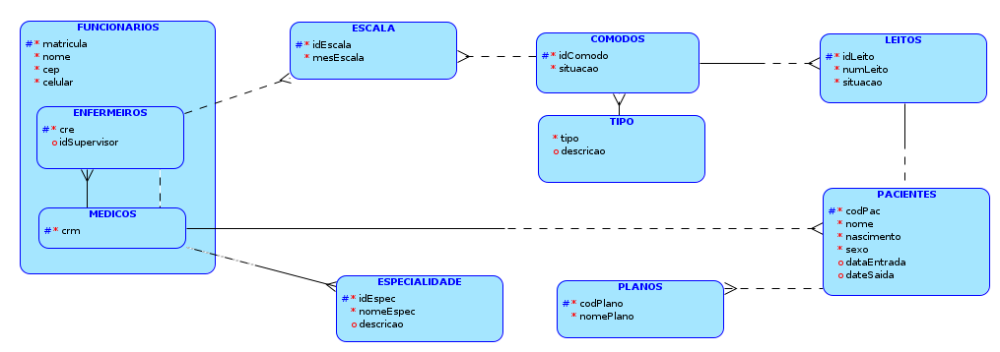
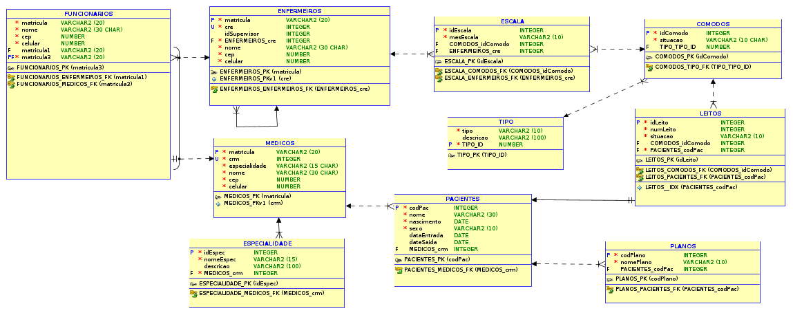

A gerência do Hospital HSM quer melhorar a gestão da ocupação dos seus
cômodos e leitos. Para tal, pediu à sua equipe de construção de um SI, inicie a
elaboração de um DER que atenda à necessidade de informação do hospital, cuja
descrição está no texto base dado.

### Texto Base:

O HSM trabalha só com internato de pacientes (não há atendimento de pronto-
socorro e/ou ambulatorial). Existem 3 diferentes tipos de cômodos: Apartamento (1 leito)
Quarto (2 leitos) e Enfermagem (5 leitos). Ao todo são 25 cômodos. Os donos pretendem
aumentar a quantidade de cômodos e diversificar os tipos de cômodos com novos
formatos e quantitativos de leitos.

Cada cômodo é identificado por um número. Alguns cômodos, embora prontos e
identificados, podem estar em reforma ou ainda não terem seus leitos identificados.

Com o novo sistema, cada paciente que entrar no hospital deverá ser cadastrado
e ficar sob responsabilidade de um médico (médico responsável pelo internato), que
pertence forçosamente ao quando de médicos do hospital. Havendo necessidade, um
paciente pode mudar de médico responsável durante seu internato. Quando o paciente
sai do hospital seus dados são guardados em um histórico que não estará incluído no
escopo deste projeto.

Pacientes pagam suas contas através de cobertura particular ou com planos de
saúde. Um paciente não pode ter seus custos pagos por mais de um plano de saúde.
Atualmente são os seguintes planos conveniados: Unimed, GC, Amil, Bradesco e Cassi.
Existe a intenção na ampliação de convênios.

No HSM existem enfermeiros e estes são alocados aos cômodos (para
atendimento) com base em uma escala mensal de alocação. Nesta escala, um cômodo
pode ser atendido por vários enfermeiros, que pode atender vários cômodos ao mesmo
tempo. Todo mês a escala é refeita.

Os médicos devem ter um registro no CRM (Conselho Regional de Medicina) e
sua especialidade (ortopedia, ginecologia, etc) registrada. Os enfermeiros devem ter um
registro no CRE (Conselho Regional de Enfermagem). Um enfermeiro pode supervisionar
outros enfermeiros e todo enfermeiro deve ter um supervisor (exceto se ele mesmo for
um supervisor).

A gerência do HSM quer que o sistema forneça basicamente as seguintes
informações:

1. Quais são os cômodos existentes, o tipo de cada cômodo, os leitos de cada um
deles e a situação de cada cômodo (em manutenção, em operação ou
desativado).
2. Relação dos leitos existentes no hospital e situação de cada um deles (ocupado
ou disponível).
3. Pacientes internados com: nome; nascimento; sexo; número do cômodo onde
está internado; número do leito que ocupa; e dados do médico responsável
(nome, endereço e celular);
4. Para cada plano de saúde, saber os pacientes que estão sendo cobertos por
aquele plano de saúde (nome do paciente, data da internamento e data provável
de saída);
5. A escala de enfermeiros em vigor, contendo: número de cada cômodo e
respectivos enfermeiros de escala para o mesmo (nome do enfermeiro e telefone
para contato).

# ENTIDADES
1. comodos
2. medico
3. leito
4. pacientes
5. plano
6. escala

### Comodos
#### Atributos: 
> - idComodo;
> - tipo; (Apartamento (1 leito) Quarto (2 leitos) e Enfermagem (5 leitos))
> - situacao (em manutenção, em operação ou desativado)
> - fk idtLeitos;

### Funcionarios
#### Atributos:
> - idFunc;
> - nome; 
> - cep;
> - celular.

### Medicos
#### Atributos: 
> - crm;
> - fk funcionario;
> - especialidade.

### Enfermeiros
#### Atributos: 
> - cre;
> - fk funcionario;
> - idSupervisor (autorelac).

### Leitos
#### Atributos: 
> - idLeito;
> - situaçao (ocupado ou disponível).

### Pacientes
#### Atributos: 
> - idPaciente;
> - nome;
> - nascimento;
> - sexo;
> - numeroComodo;
> - numeroLeito;
> - fk id medico.

### Internamento
#### Atributos:
> - idInter;
> - fk idplano;
> - fk idPaciente;
> - dataInter;
> - dataSaida.

### Planos
#### Atributos: 
> - idPlano;
> - idPaciente.

### Escala
#### Atributos: 
> - idEscala;
> - fk idComodo;
> - fk idEnf.

### historico
#### Atributos
> - 

# Logical

# Relational
