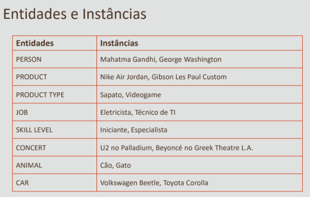

# Entidades
É uma representação de algo do mundo real que faz parte do SI em desenvolvimento
> ex: ALUNOS, PROFESSORES, CURSOS

São o conjunto de objetos, ou seja, conjunto de alunos em ALUNOS
# Instância 
Ocorrencia de uma entidade

# Atributos
Dados de uma Entidade, para distinguir uma Instância da outra

