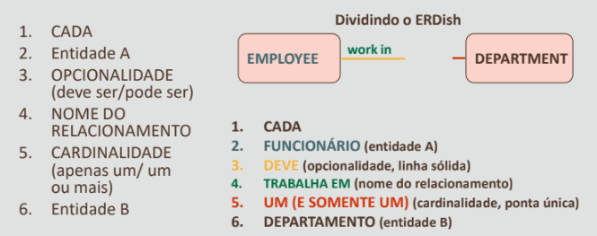

# Relacionamento
Relacionamento é a forma como duas ou mais pessoas
ou coisas estão conectadas.

# Relacionamentos em Modelos de Dados

### Relacionamentos:
- Representam algo de importância para a empresa
- Mostram como as entidades estão relacionadas
- Exigem apenas entre entidades (ou uma entidade e si mesma)
- São bidirecionais
- Recebem nomes nas duas pontas
- Têm opcionalidade
- Têm cardinalidade

# Modelagem

1. Entidades são representadas por softboxes
2. Os nomes das entidades são inseridos nas softboxes
3. Os nomes das entidades são sempre grafados no singular e escritos com todas as letras maiúsculas 

'#' - representa um atributo exclusivo.\
'*' - atributo obrigatório.\
'o' - atributo opicional.

### Esquerda para a direita

### Direita para a esquerda

### Todos os componentes
